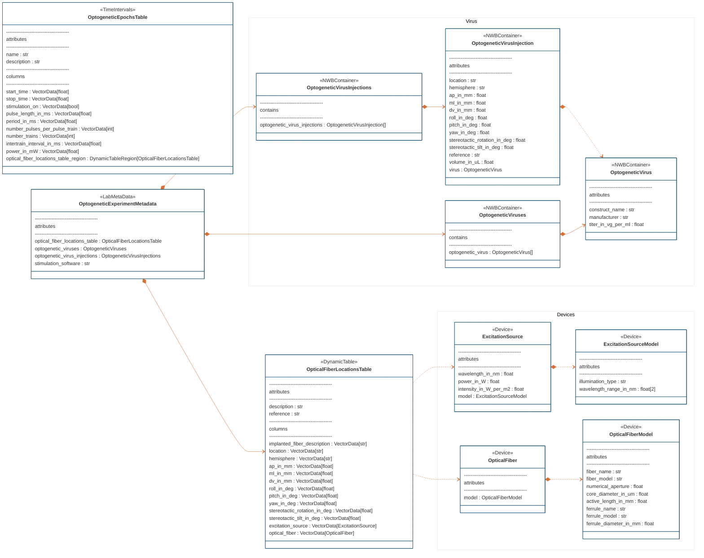

# ndx-optogenetics Extension for NWB

NWB extension to enhance support for optogenetics data and metadata in NWB. This extension provides neurodata types for documenting optogenetic experiments, including excitation sources, optical fibers, virus injections, and stimulation parameters.

## Installation

```bash
pip install ndx-optogenetics
```

## Neurodata Types

### Device Types

#### ExcitationSourceModel
A model of an excitation source device (e.g., laser, LED) with attributes:
- `illumination_type`: Type of illumination (e.g., LED, Gas Laser, Solid-State Laser)
- `wavelength_range_in_nm`: Excitation wavelength range in nm [min, max]

#### ExcitationSource
A specific excitation source device instance with attributes:
- `wavelength_in_nm`: Peak excitation wavelength
- `power_in_W`: Excitation power in Watts
- `intensity_in_W_per_m2`: Light intensity in W/m²
- Links to its corresponding `ExcitationSourceModel`

#### OpticalFiberModel
A model of an optical fiber with attributes for the fiber and ferrule specifications:
- `fiber_name`: Name of the optical fiber
- `fiber_model`: Model/product ID
- `manufacturer`: Manufacturer name
- `numerical_aperture`: Numerical aperture value
- `core_diameter_in_um`: Core diameter in micrometers
- `active_length_in_mm`: Active length for tapered fibers
- Various ferrule specifications (name, model, diameter)

#### OpticalFiber
A specific optical fiber device instance that links to its corresponding `OpticalFiberModel`

### Experimental Metadata Types

#### OptogeneticVirus
Metadata about an optogenetic virus with attributes:
- `construct_name`: Name of the virus construct/vector
- `manufacturer`: Virus manufacturer
- `titer_in_vg_per_ml`: Titer in viral genomes per mL

#### OptogeneticVirusInjection
Information about a virus injection with attributes:
- Location coordinates (AP, ML, DV) relative to a reference point
- Injection angles (pitch, yaw, roll)
- `volume_in_uL`: Injection volume
- `injection_date`: Date of injection
- Links to the corresponding `OptogeneticVirus`

#### OpticalFiberLocationsTable
A dynamic table for documenting implanted optical fiber locations with columns for:
- Stereotactic coordinates (AP, ML, DV)
- Implant angles (pitch, yaw, roll)
- Links to the corresponding `ExcitationSource` and `OpticalFiber` devices

Because this type extends the `DynamicTable` class, you can add new columns to it without having to define a new type. You can also annotate a row of it with anatomical localization information using the [ndx-anatomical-localization](https://github.com/bendichter/ndx-anatomical-localization) extension.

#### OptogeneticEpochsTable
A dynamic table for documenting stimulation parameters per epoch:
- `stimulation_on`: Whether stimulation was active
- `pulse_length_in_ms`: Duration of each pulse
- `period_in_ms`: Time between pulse starts
- `number_pulses_per_pulse_train`: Number of pulses per train
- `number_trains`: Number of trains per stimulus
- `intertrain_interval_in_ms`: Time between train starts
- `power_in_mW`: Stimulation power
- `optical_fiber_locations_table_region`: A link to the row(s) of the `OpticalFiberLocationsTable` that correspond to this epoch

Because this type extends the `DynamicTable` class, you can add new columns to it without having to define a new type.

#### OptogeneticExperimentMetadata
Container for all optogenetics-related metadata including:
- `OpticalFiberLocationsTable`
- Collection of `OptogeneticVirus` objects (optional)
- Collection of `OptogeneticVirusInjection` objects (optional)
- `stimulation_software`: Name of software used for stimulation

You can define extensions to this ndx-optogenetics extension to store additional metadata in a structured
way. For example, the upcoming update to the
[ndx-franklab-novela extension](https://github.com/LorenFrankLab/ndx-franklab-novela) 
defines a `FrankLabOptogeneticEpochsTable` that extends the `OptogeneticEpochsTable` defined here to store Frank Lab-specific optogenetic stimulation parameters for each epoch.

## Entity Relationship Diagram



## Usage Example

```python
from datetime import datetime, timezone
from pynwb import NWBFile, NWBHDF5IO
from ndx_optogenetics import (
    ExcitationSourceModel,
    ExcitationSource,
    OpticalFiberModel,
    OpticalFiber,
    OpticalFiberLocationsTable,
    OptogeneticVirus,
    OptogeneticVirusInjection,
    OptogeneticViruses,
    OptogeneticVirusInjections,
    OptogeneticExperimentMetadata,
    OptogeneticEpochsTable,
)

# Initialize NWB file
nwbfile = NWBFile(
    session_description="session_description",
    identifier="identifier",
    session_start_time=datetime.now(timezone.utc),
)

# Create and add excitation source devices
excitation_source_model = ExcitationSourceModel(
    name="Omicron LuxX+ 488-100 Model",
    description="Laser for optogenetic stimulation.",
    manufacturer="Omicron",
    illumination_type="laser",
    wavelength_range_in_nm=[488.0, 488.0],
)
excitation_source = ExcitationSource(
    name="Omicron LuxX+ 488-100",
    model=excitation_source_model,
    wavelength_in_nm=488.0,
    power_in_W=0.077,
    intensity_in_W_per_m2=1.0e10,
)
nwbfile.add_device(excitation_source_model)
nwbfile.add_device(excitation_source)

# Create and add optical fiber devices
optical_fiber_model = OpticalFiberModel(
    name="Lambda Model",
    description="Lambda fiber (tapered fiber) from Optogenix.",
    fiber_name="Lambda",
    fiber_model="lambda_b5",
    manufacturer="Optogenix",
    numerical_aperture=0.39,
    core_diameter_in_um=200.0,
    active_length_in_mm=2.0,
    ferrule_name="cFCF - ∅2.5mm Ceramic Ferrule",
    ferrule_diameter_in_mm=2.5,
)
optical_fiber = OpticalFiber(
    name="Lambda",
    model=optical_fiber_model,
)
nwbfile.add_device(optical_fiber_model)
nwbfile.add_device(optical_fiber)

# Create optical fiber locations table
optical_fiber_locations_table = OpticalFiberLocationsTable(
    description="Information about implanted optical fiber locations",
    reference="Bregma at the cortical surface",
)
optical_fiber_locations_table.add_row(
    implanted_fiber_description="Lambda fiber implanted into right GPe.",
    location="GPe",
    hemisphere="right",
    ap_in_mm=-1.5,
    ml_in_mm=3.2,
    dv_in_mm=-5.8,
    roll_in_deg=0.0,
    pitch_in_deg=0.0,
    yaw_in_deg=0.0,
    excitation_source=excitation_source,
    optical_fiber=optical_fiber,
)

# Create virus and injection metadata
virus = OptogeneticVirus(
    name="AAV-EF1a-DIO-hChR2(H134R)-EYFP",
    construct_name="AAV-EF1a-DIO-hChR2(H134R)-EYFP",
    description="Excitatory optogenetic construct for ChR2-EYFP expression",
    manufacturer="UNC Vector Core",
    titer_in_vg_per_ml=1.0e12,
)
optogenetic_viruses = OptogeneticViruses(optogenetic_virus=[virus])

virus_injection = OptogeneticVirusInjection(
    name="AAV-EF1a-DIO-hChR2(H134R)-EYFP Injection",
    description="AAV-EF1a-DIO-hChR2(H134R)-EYFP injection into GPe.",
    hemisphere="right",
    location="GPe",
    ap_in_mm=-1.5,
    ml_in_mm=3.2,
    dv_in_mm=-6.0,
    roll_in_deg=0.0,
    pitch_in_deg=0.0,
    yaw_in_deg=0.0,
    reference="Bregma at the cortical surface",
    virus=virus,
    volume_in_uL=0.45,
)
optogenetic_virus_injections = OptogeneticVirusInjections(optogenetic_virus_injections=[virus_injection])

# Create experiment metadata container
optogenetic_experiment_metadata = OptogeneticExperimentMetadata(
    optical_fiber_locations_table=optical_fiber_locations_table,
    optogenetic_viruses=optogenetic_viruses,
    optogenetic_virus_injections=optogenetic_virus_injections,
    stimulation_software="FSGUI 2.0",
)
nwbfile.add_lab_meta_data(optogenetic_experiment_metadata)

# Create stimulation epochs table
opto_epochs_table = OptogeneticEpochsTable(
    name="optogenetic_epochs",
    description="Metadata about optogenetic stimulation parameters per epoch",
    target_tables={"optical_fiber_locations_table_region": optical_fiber_locations_table},
)
opto_epochs_table.add_row(
    start_time=0.0,
    stop_time=100.0,
    stimulation_on=True,
    pulse_length_in_ms=40.0,
    period_in_ms=250.0,
    number_pulses_per_pulse_train=100,
    number_trains=1,
    intertrain_interval_in_ms=0.0,
    power_in_mW=77.0,
    optical_fiber_locations_table_region=0,
)
nwbfile.add_time_intervals(opto_epochs_table)

# Write the file
path = "example.nwb"
with NWBHDF5IO(path, mode="w") as io:
    io.write(nwbfile)
```

---
This extension was created using [ndx-template](https://github.com/nwb-extensions/ndx-template).
