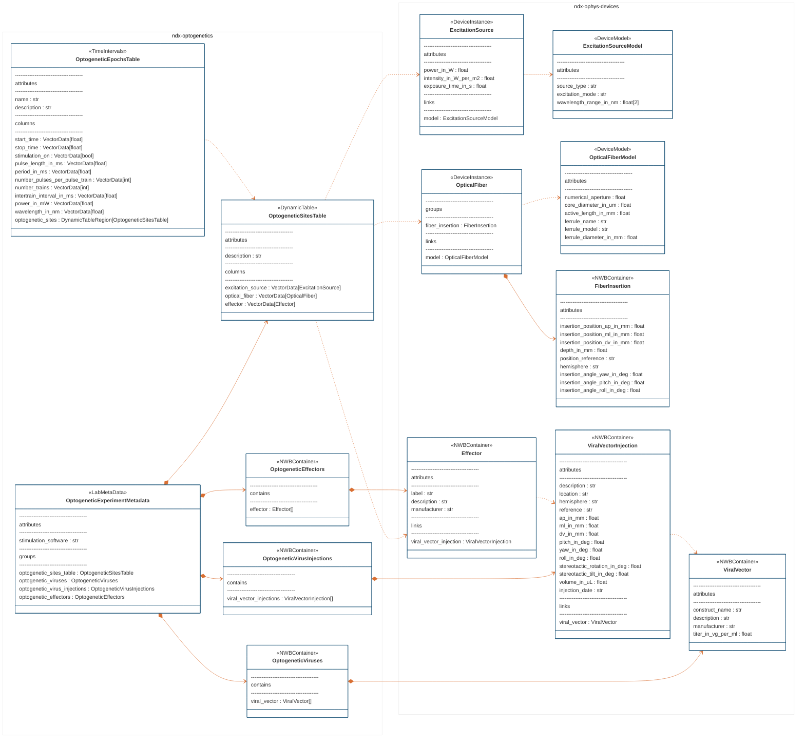

# ndx-optogenetics Extension for NWB

A comprehensive NWB extension for documenting optogenetic experiments, providing structured metadata storage for stimulation hardware, viral vectors, injection procedures, and experimental parameters.

## Installation

```bash
pip install ndx-optogenetics
```

## Neurodata Types

This extension provides neurodata types for documenting optogenetic experiments, including excitation sources, optical fibers, virus injections, and stimulation parameters.

### Device Specification Types (ndx-ophys-devices)

This extension depends on `ndx-ophys-devices`, which provides the foundational device types for specifying the physical hardware and biological components used in optical physiology experiments, which include but are not limited to optogenetics. These types follow a model-instance pattern where device models define specifications and device instances represent actual hardware with specific configurations.

#### ExcitationSource & ExcitationSourceModel
**ExcitationSourceModel**: Template specifications for light sources
- `source_type`: Type of light source (e.g., "laser", "LED")
- `excitation_mode`: Mode of excitation (e.g., "one-photon")
- `wavelength_range_in_nm`: Supported wavelength range [min, max]

**ExcitationSource**: Specific light source instance
- `power_in_W`: Maximum power output
- `intensity_in_W_per_m2`: Light intensity at the fiber tip
- `exposure_time_in_s`: Typical exposure duration
- Links to its corresponding `ExcitationSourceModel`

#### OpticalFiber & OpticalFiberModel
**OpticalFiberModel**: Template specifications for optical fibers
- `numerical_aperture`: Numerical aperture value
- `core_diameter_in_um`: Core diameter in micrometers
- `active_length_in_mm`: Active length for tapered fibers
- Ferrule specifications (name, model, diameter)

**OpticalFiber**: Specific fiber instance with implantation details
- `serial_number`: Unique identifier for this fiber
- `fiber_insertion`: Container with stereotactic coordinates and angles
- Links to its corresponding `OpticalFiberModel`

#### FiberInsertion
Detailed implantation information for optical fibers:
- Stereotactic coordinates (`insertion_position_ap_in_mm`, `insertion_position_ml_in_mm`, `insertion_position_dv_in_mm`)
- `depth_in_mm`: Insertion depth
- `position_reference`: Reference point for coordinates (e.g., "Bregma")
- `hemisphere`: Target hemisphere
- Insertion angles (`insertion_angle_pitch_in_deg`, `insertion_angle_yaw_in_deg`, `insertion_angle_roll_in_deg`)

#### ViralVector & ViralVectorInjection
**ViralVector**: Viral construct specifications
- `construct_name`: Name of the viral construct/vector
- `description`: Detailed description of the construct
- `manufacturer`: Source of the viral vector
- `titer_in_vg_per_ml`: Viral titer in genomes per mL

**ViralVectorInjection**: Injection procedure details
- Stereotactic coordinates and angles
- `volume_in_uL`: Volume injected
- `injection_date`: Date of injection procedure
- `location`: Target brain region
- `hemisphere`: Target hemisphere
- Links to the corresponding `ViralVector`

#### Effector
Represents the optogenetic effector protein (e.g., channelrhodopsin, halorhodopsin):
- `label`: Common name of the effector (e.g., "ChR2-EYFP")
- `description`: Detailed description of the effector
- `manufacturer`: Source of the effector construct
- Links to the corresponding `ViralVectorInjection`
#### OptogeneticExperimentMetadata
The main container for all optogenetics-related metadata in an experiment.

**Purpose**: Serves as the top-level organizational structure that brings together all optogenetic components for a session.

**Contains**:
- `optogenetic_sites_table`: Table documenting stimulation sites and their components
- `optogenetic_viruses`: Container for viral vector specifications (optional)
- `optogenetic_virus_injections`: Container for injection procedure details (optional)  
- `optogenetic_effectors`: Container for effector protein information (optional)
- `stimulation_software`: Name of software used for stimulation delivery

#### OptogeneticSitesTable
A dynamic table documenting the physical stimulation sites and their associated components.

**Purpose**: Links together the three key components at each stimulation site: the excitation source (light), optical fiber (delivery), and effector (biological target).

**Columns**:
- `excitation_source`: Reference to the `ExcitationSource` device
- `optical_fiber`: Reference to the `OpticalFiber` device  
- `effector`: Reference to the `Effector` protein targeted at this site

**Extensibility**: Since this extends `DynamicTable`, you can add custom columns without defining new types. You can also annotate rows with anatomical information using the [ndx-anatomical-localization](https://github.com/bendichter/ndx-anatomical-localization) extension.

#### OptogeneticEpochsTable
A dynamic table documenting stimulation parameters that may vary across experimental epochs.

**Purpose**: Captures the temporal aspects of optogenetic stimulation, including both stimulation and control epochs.

**Key Columns**:
- `stimulation_on`: Boolean indicating if stimulation was active during this epoch
- `pulse_length_in_ms`: Duration of individual light pulses
- `period_in_ms`: Time between pulse starts (determines pulse frequency)
- `number_pulses_per_pulse_train`: Number of pulses in each train
- `number_trains`: Number of trains per stimulation episode
- `intertrain_interval_in_ms`: Time between train starts
- `power_in_mW`: Stimulation power during this epoch
- `wavelength_in_nm`: Excitation wavelength used
- `optogenetic_sites`: References to rows in `OptogeneticSitesTable` for this epoch

**Usage Notes**: 
- Control epochs should have `stimulation_on=False` with other parameters set to 0 or NaN
- Multiple sites can be referenced per epoch for simultaneous stimulation
- Extends `TimeIntervals` so includes `start_time` and `stop_time` columns

#### Container Types

These container types organize related objects within `OptogeneticExperimentMetadata`:

**OptogeneticViruses**
- Contains one or more `ViralVector` objects
- Groups all viral constructs used in the experiment

**OptogeneticVirusInjections**  
- Contains one or more `ViralVectorInjection` objects
- Groups all injection procedures performed

**OptogeneticEffectors**
- Contains one or more `Effector` objects  
- Groups all effector proteins targeted in the experiment

### Extension Development

You can extend this framework for lab-specific needs. For example, the upcoming [ndx-franklab-novela extension](https://github.com/LorenFrankLab/ndx-franklab-novela) defines a `FrankLabOptogeneticEpochsTable` that extends `OptogeneticEpochsTable` to include Frank Lab-specific stimulation parameters.

## Entity Relationship Diagram



## Usage Example

```python
from datetime import datetime, timezone
from pynwb import NWBFile, NWBHDF5IO
from ndx_ophys_devices import (
    ViralVector,
    ViralVectorInjection,
    Effector,
    ExcitationSourceModel,
    ExcitationSource,
    OpticalFiberModel,
    OpticalFiber,
    FiberInsertion,
)
from ndx_optogenetics import (
    OptogeneticSitesTable,
    OptogeneticViruses,
    OptogeneticVirusInjections,
    OptogeneticEffectors,
    OptogeneticExperimentMetadata,
    OptogeneticEpochsTable,
)

# Initialize NWB file
nwbfile = NWBFile(
    session_description="session_description",
    identifier="identifier",
    session_start_time=datetime.now(timezone.utc),
)

# Create and add excitation source devices
excitation_source_model = ExcitationSourceModel(
    name="Omicron LuxX+ 488-100 Model",
    description="Laser for optogenetic stimulation.",
    manufacturer="Omicron",
    source_type="laser",
    excitation_mode="one-photon",
    wavelength_range_in_nm=[488.0, 488.0],
)
excitation_source = ExcitationSource(
    name="Omicron LuxX+ 488-100",
    model=excitation_source_model,
    power_in_W=0.077,
    intensity_in_W_per_m2=1.0e10,
)
nwbfile.add_device_model(excitation_source_model)
nwbfile.add_device(excitation_source)

# Create and add optical fiber devices
optical_fiber_model = OpticalFiberModel(
    name="Lambda Model",
    description="Lambda fiber (tapered fiber) from Optogenix.",
    model_number="lambda_b5",
    manufacturer="Optogenix",
    numerical_aperture=0.39,
    core_diameter_in_um=200.0,
    active_length_in_mm=2.0,
    ferrule_name="cFCF - ∅2.5mm Ceramic Ferrule",
    ferrule_diameter_in_mm=2.5,
)
fiber_insertion = FiberInsertion(
    name="fiber_insertion",
    depth_in_mm=2.0,
    insertion_position_ap_in_mm=-1.5,
    insertion_position_ml_in_mm=3.2,
    insertion_position_dv_in_mm=-5.8,
    position_reference="Bregma at the cortical surface",
    hemisphere="right",
    insertion_angle_pitch_in_deg=0.0,
)
optical_fiber = OpticalFiber(
    name="Lambda",
    description="Lambda fiber implanted into right GPe.",
    serial_number="123456",
    model=optical_fiber_model,
    fiber_insertion=fiber_insertion,
)
nwbfile.add_device_model(optical_fiber_model)
nwbfile.add_device(optical_fiber)

# Create virus and injection metadata
virus = ViralVector(
    name="AAV-EF1a-DIO-hChR2(H134R)-EYFP",
    construct_name="AAV-EF1a-DIO-hChR2(H134R)-EYFP",
    description="Excitatory optogenetic construct for ChR2-EYFP expression",
    manufacturer="UNC Vector Core",
    titer_in_vg_per_ml=1.0e12,
)
optogenetic_viruses = OptogeneticViruses(viral_vectors=[virus])

virus_injection = ViralVectorInjection(
    name="AAV-EF1a-DIO-hChR2(H134R)-EYFP Injection",
    description="AAV-EF1a-DIO-hChR2(H134R)-EYFP injection into GPe.",
    hemisphere="right",
    location="GPe",
    ap_in_mm=-1.5,
    ml_in_mm=3.2,
    dv_in_mm=-6.0,
    roll_in_deg=0.0,
    pitch_in_deg=0.0,
    yaw_in_deg=0.0,
    reference="Bregma at the cortical surface",
    viral_vector=virus,
    volume_in_uL=0.45,
    injection_date="1970-01-01T00:00:00+00:00",
)
optogenetic_virus_injections = OptogeneticVirusInjections(viral_vector_injections=[virus_injection])

effector = Effector(
    name="effector",
    description="Excitatory opsin",
    label="hChR2-EYFP",
    viral_vector_injection=virus_injection,
)
optogenetic_effectors = OptogeneticEffectors(effectors=[effector])

# Create OptogeneticSitesTable
optogenetic_sites_table = OptogeneticSitesTable(description="Information about the optogenetic stimulation sites.")
optogenetic_sites_table.add_row(
    excitation_source=excitation_source,
    optical_fiber=optical_fiber,
    effector=effector,
)

# Create experiment metadata container
optogenetic_experiment_metadata = OptogeneticExperimentMetadata(
    optogenetic_sites_table=optogenetic_sites_table,
    optogenetic_viruses=optogenetic_viruses,
    optogenetic_virus_injections=optogenetic_virus_injections,
    optogenetic_effectors=optogenetic_effectors,
    stimulation_software="FSGUI 2.0",
)
nwbfile.add_lab_meta_data(optogenetic_experiment_metadata)

# Create stimulation epochs table
opto_epochs_table = OptogeneticEpochsTable(
    name="optogenetic_epochs",
    description="Metadata about optogenetic stimulation parameters per epoch",
    target_tables={"optogenetic_sites": optogenetic_sites_table},
)
opto_epochs_table.add_row(
    start_time=0.0,
    stop_time=100.0,
    stimulation_on=True,
    pulse_length_in_ms=40.0,
    period_in_ms=250.0,
    number_pulses_per_pulse_train=100,
    number_trains=1,
    intertrain_interval_in_ms=0.0,
    power_in_mW=77.0,
    wavelength_in_nm=488.0,
    optogenetic_sites=[0],
)
nwbfile.add_time_intervals(opto_epochs_table)

# Write the file
path = "test_optogenetics.nwb"
with NWBHDF5IO(path, mode="w") as io:
    io.write(nwbfile)
```

---
This extension was created using [ndx-template](https://github.com/nwb-extensions/ndx-template).
